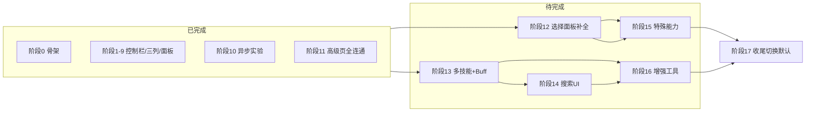

# PySide6 迁移方案

> 将 GUI 层从 CustomTkinter（CTk）逐步替换为 PySide6（Qt for Python）。
> 架构决策见 [`docs/adr/0002-migrate-to-pyside6.md`](adr/0002-migrate-to-pyside6.md)。

---

## 1. 迁移动机

| 痛点 | 根因 | PySide6 解决方案 |
|------|------|------------------|
| 主线程计算导致画面卡顿 | tkinter 无 QThread，耗时计算阻塞 `mainloop` | `QThread` + `signal`/`slot` 通知 GUI 更新 |
| 页面切换撕裂 | tkinter 无双缓冲，`grid_forget`/`pack_forget` 造成肉眼可见闪烁 | Qt 双缓冲渲染 + 垂直同步，`QStackedWidget` 无闪切换 |
| 控件文字截断 | CTk widget 使用像素固定宽，超出直接截断 | `QFontMetrics`、`sizeHint()`、`wordWrap` 自动适配内容 |
| 控件布局随意 | tkinter 布局管理弱，调试困难 | Qt `QHBoxLayout`/`QVBoxLayout`/`QGridLayout` 布局可预测 |

---

## 2. 架构总览

```
ENDFIELD_UI_BACKEND=ctk  (默认)     ENDFIELD_UI_BACKEND=qt
        │                                   │
        ▼                                   ▼
   gui_design/                          gui_design/
   ├── shell/app.py                     ├── shell/qt_app.py
   │    (CTk 根窗口)                    │    (QMainWindow 根窗口)
   ├── panels/                          ├── panels/
   │   ├── selection/panel.py           │   ├── selection/qt_panel.py
   │   ├── skill_level_panel.py         │   ├── qt_skill_level_panel.py
   │   └── ...                          │   └── ...
   ├── controls/                        ├── controls/
   │   ├── enhancement/section.py       │   ├── enhancement/qt_section.py
   │   └── ...                          │   └── ...
   └── shell/app_control_dock.py        └── shell/qt_control_dock.py
```

- 两套实现**平行共存**，Python 层面互不依赖
- 通过 `__init__.py` 根据环境变量 **编译期切换**导入
- CTk 版始终保持可用，逐步替换到 Qt 版文件删除为止

---

## 3. 切换机制

### 3.1 优先级

1. 环境变量：`ENDFIELD_UI_BACKEND=qt`
2. UI 偏好文件：`ui_preferences.json` 中 `"backend"` 字段
3. 默认值：`"ctk"`（最终阶段改为 `"qt"`）

### 3.2 模块分发层

每个包含双后端实现的模块，在其 `__init__.py` 中做运行时切换：

```python
# gui_design/shell/__init__.py
import os

def _detect_backend() -> str:
    env = os.environ.get("ENDFIELD_UI_BACKEND", "").strip().lower()
    if env in ("qt", "pyside6"):
        return "qt"
    # TODO: 后续从 ui_preferences.json 读取
    return "ctk"

_BACKEND = _detect_backend()
```

### 3.3 文件命名约定

| 后端 | 文件名模式 | 示例 |
|------|-----------|------|
| CTk | `*.py`（原样） | `app_control_dock.py`、`section.py` |
| PySide6 | `qt_*.py` | `qt_control_dock.py`、`qt_section.py` |

---

## 4. 分步迁移计划

### 阶段 0：基础设施（Day 1-2）✅ 已完成

- [x] **0.1** `pyproject.toml` 添加 `pyside6` optional dependency
- [x] **0.2** 创建 `gui_design/backends/` 目录
- [x] **0.3** 创建 `gui_design/shell/qt_app.py` — `QMainWindow` + `QApplication`
- [x] **0.4** 切换测试：`ENDFIELD_UI_BACKEND=qt python main.py` 启动 Qt 空窗口

### 阶段 1–9：Qt 控制栏 + 显示三列 + 选择面板 + 高级页连线 ✅ 已完成

- [x] **1** `qt_control_dock.py` — 高级页控制栏（三列布局、按钮、下拉、开关）
- [x] **2** `backends/qt_worker.py` — `CalcWorker`（QObject + QThread）
- [x] **3** `qt_columns.py` — 属性展示三列（QTableWidget 三列）
- [x] **4** `qt_panel.py` / `qt_subpanels.py` — 角色/武器选择面板（QComboBox + QSlider）
- [x] **5** `qt_app.py` — 双页签集成 + 面板联动
- [x] **6–9** 控制信号路由、确认刷新、高级页控件全连通

### 阶段 10：CalcWorker 异步确认实验 ✅ 已完成

- [x] **10.1** 审查同步确认流程 + CalcWorker 接口
- [x] **10.2** 尝试 `_on_confirm` 异步化（发现 QBasicTimer 跨线程限制）
- [x] **10.3** 结论：保持同步，未来需将 compute/render 解耦后再异步

### 阶段 11：高级页控件全连通 ✅ 已完成

- [x] **11.1** 敌人插件下拉（`list_plugin_enemy_choices` + `enemy_defense`）
- [x] **11.2** 手动 Buff 按钮 → 占位对话框
- [x] **11.3** 固定配装四槽（装备名下拉 + catalog 联动）
- [x] **11.4** 异常矩阵 / 伤害口径 / 暴击调整 → `_build_request`
- [x] **11.5** 运行时验证全部控件可读写

─── 以下为剩余 CTk 模块的迁移阶段 ───

### 阶段 12：Qt 选择面板补全（技能等级 + 信赖 + 特殊能力）

**目标**：补全 Qt 选择面板中缺失的子控件，使角色/武器面板功能与 CTk 版持平。

**涉及文件**：
| CTk 源文件 | 行数 | Qt 目标文件 | 说明 |
|------------|------|------------|------|
| `panels/skill_level_panel.py` | ~274 | `panels/selection/qt_subpanels.py` | 3 技能等级 QSlider |
| `panels/trust_panel.py` | ~81 | `panels/selection/qt_subpanels.py` | 信赖 QSlider |
| `panels/special_ability/` | ~360 | `panels/selection/qt_subpanels.py` | 特殊能力滑块联动 |

**任务清单**：
- [ ] **12.1** 审查 `skill_level_panel.py`：3 个 QSlider（1–9 级），`state.enable/disable` 联动，`get/set` accessor
- [ ] **12.2** 审查 `trust_panel.py`：1 个 QSlider（0–200），`setTrustLevel` 标签更新
- [ ] **12.3** 审查 `special_ability/`：build_mixin（创建 6 组滑块标签）、handlers_mixin（回调）、refresh_mixin（角色/武器切换时重建）
- [ ] **12.4** 在 `qt_subpanels.py` 中创建 Qt 技能等级面板：`QSlider` + `QLabel` 标签，样式 `_COMBO_STYLE` 一致
- [ ] **12.5** 创建 Qt 信赖面板：单行 QSlider + QLabel
- [ ] **12.6** 创建 Qt 特殊能力面板：普通技能（第一/第二/第三）+ 特殊技能（特殊一/特殊二）6 组滑块
- [ ] **12.7** 嵌入 `qt_panel.py`：在类型/星级/名称/等级后追加技能等级、信赖、特殊能力
- [ ] **12.8** 信号连线：滑块值变化 → `_on_loadout_changed`
- [ ] **12.9** 运行时验证：角色/武器切换后滑块重建，值正确读取

### 阶段 13：Qt 多技能次数 + 手动 Buff 编辑窗

**目标**：迁移高级页第三列的多技能次数开关、段级输入行、物理/法术异常矩阵，以及配套的手动 Buff 编辑窗口。

**涉及文件**：
| CTk 源文件 | 行数 | Qt 目标文件 | 说明 |
|------------|------|------------|------|
| `controls/multi_skill/section.py` | ~180 | `gui_design/controls/multi_skill/qt_section.py` | 多技能区块 |
| `controls/multi_skill/rows.py` | ~270 | `gui_design/controls/multi_skill/qt_section.py` | 段级行重建 |
| `controls/manual_buff/window.py` | ~200 | `gui_design/controls/manual_buff/qt_window.py` | 手动 Buff 弹窗 |

**任务清单**：
- [ ] **13.1** 审查 CTk 实现：`place_multi_skill_section` 创建手动次数开关 → 段级输入行（按角色动态） → Buff 按钮 → 异常矩阵
- [ ] **13.2** 创建 `gui_design/controls/multi_skill/qt_section.py`：
  - `QScrollArea` 包裹全部内容
  - `QCheckBox` 替代 CTkSwitch「使用手动次数」
  - 段级输入行：`QLineEdit` + `QLabel`（动态重建）
  - 物理异常矩阵：`QGridLayout`，对应 `PHYSICAL_ABNORMAL_TYPES` × `PHYSICAL_ABNORMAL_LEVELS`
  - 法术异常矩阵：同上 × `SPELL_ABNORMAL_TYPES`
  - 额外暴击率/暴伤：`QLineEdit` 行
- [ ] **13.3** 创建 `gui_design/controls/manual_buff/qt_window.py`：
  - `QDialog` 编辑器：左侧段/异常列表（`QListWidget`），右侧编辑区（`QComboBox` effect_type + `QDoubleSpinBox` value）
  - 数据读写走既有的 `calculation/manual_buff/model.py`
- [ ] **13.4** 嵌入 `qt_control_dock.py` 第三列，替换当前硬编码占位行
- [ ] **13.5** 接入 `qt_app.py`：段数变化 → `_on_loadout_changed`
- [ ] **13.6** 运行时验证：手动次数开关、段级输入、异常矩阵、Buff 编辑窗

### 阶段 14：Qt 搜索 UI（全量遍历）

**目标**：迁移高级页第二列的搜索区域（武器候选范围 / 装备范围 / 搜索按钮 / 线程 / 结果弹窗）。

**涉及文件**：
| CTk 源文件 | 行数 | Qt 目标文件 | 说明 |
|------------|------|------------|------|
| `controls/search/section.py` | ~295 | `gui_design/controls/search/qt_section.py` | 搜索 UI 布局 |
| `controls/search/actions.py` | ~200 | `gui_design/controls/search/qt_actions.py` | 搜索线程 |
| `search_ui/search_results_view.py` | ~80 | `gui_design/search_ui/qt_results_view.py` | 结果弹窗 |
| `search_ui/search_settings.py` | ~60 | `search_ui/search_settings.py`（复用） | 纯逻辑，不依赖 CTk |
| `search_ui/search_estimate_message.py` | ~40 | `search_ui/search_estimate_message.py`（复用） | 纯逻辑，不依赖 CTk |
| `search_ui/search_export_paths.py` | ~20 | `search_ui/search_export_paths.py`（复用） | 纯逻辑，不依赖 CTk |

**任务清单**：
- [ ] **14.1** 审查 CTk 搜索 action 流：`build_search_job_inputs` → `prepare_search_job` → `run_exported_single_skill_search`（子线程） → `show_search_results_dialog`（结果弹窗）
- [ ] **14.2** 创建 `qt_section.py`：搜索列 UI（武器候选范围 QComboBox + 装备范围 QComboBox + MVP 按钮 + 全量搜索按钮 + 取消按钮 + 预估标签 + 状态标签）
- [ ] **14.3** 创建 `qt_actions.py`：搜索线程封装（`QThread` + `Signal` 进度/结果/错误），绑定到搜索按钮
- [ ] **14.4** 创建 `qt_results_view.py`：`QDialog` 显示 TopN 结果（`QTableWidget` 展示武器/装备/伤害，可选导出按钮）
- [ ] **14.5** 嵌入 `qt_control_dock.py` 第二列，替换当前占位按钮
- [ ] **14.6** 运行时验证：预估显示、全量搜索运行、结果弹窗、取消搜索

### 阶段 15：Qt 特殊能力面板（独立子面板）

**目标**：创建独立的 `QWidget` 版特殊能力面板，嵌入武器选择面板。

**涉及文件**：
| CTk 源文件 | 行数 | Qt 目标文件 | 说明 |
|------------|------|------------|------|
| `panels/special_ability/panel.py` | ~108 | `panels/special_ability/qt_panel.py` | 面板主类 |
| `panels/special_ability/build_mixin.py` | ~248 | `panels/special_ability/qt_panel.py` | 控件构建 |
| `panels/special_ability/handlers_mixin.py` | ~50 | `panels/special_ability/qt_panel.py` | 回调处理 |
| `panels/special_ability/refresh_mixin.py` | ~228 | `panels/special_ability/qt_panel.py` | 数据刷新 |

**任务清单**：
- [ ] **15.1** 审查 CTk mixin 组合：`SpecialAbilityPanel(Build, Handlers, Refresh)`
- [ ] **15.2** 创建 `qt_panel.py`：`QWidget` 版 `QtSpecialAbilityPanel`
  - 第一/二/三技能：`QLabel` + `QSlider` + `QLabel`（值显示） 3 组
  - 特殊一/特殊二：`QLabel` + `QSlider`（等级） + `QSlider`（层数，可选）2–4 组
  - pack 顺序：普通技能 → 特殊技能
- [ ] **15.3** 角色/武器切换时刷新：`_on_char_name_change` → 调用 `refresh_from_weapon(weapon_data)`
- [ ] **15.4** 嵌入 `qt_panel.py` 的武器面板侧
- [ ] **15.5** 运行时验证：滑块拖动、值显示、角色武器切换后重建

### 阶段 16：Qt 增强工具（更多设置折叠区完整功能）

**目标**：将高级页「更多设置」下的全部功能弹窗从 CTkToplevel 迁移到 QDialog。

**涉及文件**：
| CTk 源文件 | 行数 | Qt 目标文件 | 说明 |
|------------|------|------------|------|
| `controls/enhancement/section.py` | ~273 | 已有 `qt_control_dock.py` 折叠框架 | 仅弹窗部分需迁移 |
| `controls/enhancement/dialogs.py` | ~200 | `qt_app.py` 替换占位回调 | 历史/仪表盘/对比弹窗 |
| `controls/enhancement/preset.py` | ~130 | `qt_app.py` 替换占位回调 | 预设导入导出 |
| `gui_design/shared/damage_visualization.py` | ~80 | 复用（无 CTk 依赖） | matplotlib 图表 |
| `gui_design/shared/preset_batch_compare.py` | ~60 | 复用（无 CTk 依赖） | 并行对比逻辑 |
| `gui_design/shared/calc_history.py` | ~40 | 复用（无 CTk 依赖） | 历史存储 |
| `legal/attribution.py` | ~50 | 已有 `_on_attribution` ✅ | 法律声明 |

**任务清单**：
- [ ] **16.1** 预设导出：当前 `_on_export_preset` 已实现 `QFileDialog` + `export_preset_json`
- [ ] **16.2** 预设导入：当前 `_on_import_preset` 已实现 `QFileDialog` + `import_presets_from_json_text`
- [ ] **16.3** 多方案对比弹窗：`QDialog` 显示对比结果 `QTableWidget`（方案名 / 伤害 / 配装摘要）
- [ ] **16.4** 伤害仪表盘弹窗：`QDialog` 嵌入 `matplotlib`（`FigureCanvasQTAgg`）
- [ ] **16.5** 计算历史弹窗：`QDialog` 显示最近 10 条 +「恢复此配置」按钮
- [ ] **16.6** 操作日志导出：当前 `_on_export_log` 已实现 `QFileDialog` + `export_to_file`
- [ ] **16.7** 启动页策略：QComboBox（「启动总是计算页」「记住上次页面」），写入 `ui_preferences.json`
- [ ] **16.8** 运行时验证：全部弹窗打开正确，数据读写正常

### 阶段 17：收尾与切换默认

- [ ] **17.1** 切换 `_BACKEND` 默认值为 `"qt"`
- [ ] **17.2** 运行全量回归测试
- [ ] **17.3** 逐一删除已迁移的 CTk 文件（保留 git 历史回滚）：
  - `panels/skill_level_panel.py`
  - `panels/trust_panel.py`
  - `panels/special_ability/` 全部 4 文件
  - `controls/multi_skill/` 全部 3 文件
  - `controls/manual_buff/` 全部 2 文件
  - `controls/search/` 全部 3 文件
  - `controls/enhancement/` 全部 4 文件
  - `controls/fixed_loadout.py`
  - `search_ui/search_results_view.py`
- [ ] **17.4** 清理 `gui_design/backends/ctk_factory.py`
- [ ] **17.5** 更新 `docs/操作指令集.md`、`docs/代码结构规范.md`
- [ ] **17.6** 更新 `docs/会话接续手册.md` 将 `last_updated` 日期改为最终切换日
- [ ] **17.7** 更新 `pyproject.toml` 将 `PySide6` 移入运行时依赖
- [ ] **17.8** 构建 exe 测试打包流程

---

## 5. 迁移顺序依赖图



- 阶段 12 和 13 可以**并行推进**（技能等级面板 vs 多技能次数）
- 阶段 15（特殊能力面板）依赖阶段 12 中 qt_panel 的嵌入接口
- 阶段 14（搜索 UI）依赖阶段 13 的固定配装 QComboBox 驱动
- 阶段 16（增强工具）依赖阶段 13–14 完成后验证
- 阶段 17 是所有阶段完成后的一步收尾

---

## 5. 测试策略

### 5.1 CTk 测试（CI 主力）

- 保持现有 `test_*.py` 套件不变（对应 CTk 实现）
- CI 仍跑全量 CTk 测试确保现有功能不被破坏

### 5.2 PySide6 冒烟测试（CI 新增）

```python
# tests/test_qt_imports.py
def test_qt_control_dock_imports():
    from gui_design.shell.qt_control_dock import build_control_dock
    assert callable(build_control_dock)
```

- 仅验证模块可导入、函数签名正确
- 不依赖 `QApplication` 实例（不启动 Qt 事件循环）
- 作为 CI 快速检查，不运行 GUI 集成测试

### 5.3 Qt GUI 集成测试（本地手动运行）

- 用 `pytest-qt` 或自定义 fixture
- 仅本地运行，不在 CI 中启用（需要 display server）

---

## 6. 回滚策略

### 阶段内回滚

```
ENDFIELD_UI_BACKEND=ctk python main.py
```
切换回环境变量即可，不修改任何代码。

### 完全回滚

```bash
git checkout -- gui_design/   # 放弃所有 qt_*.py 新建文件
git checkout -- pyproject.toml
```

### 增量回滚

删掉有问题的 `qt_*.py` 文件，修改对应 `__init__.py` 只保留 CTk 分支。

---

## 7. CTk ↔ PySide6 API 对照表

| CTk | PySide6 | 注意点 |
|-----|---------|--------|
| `ctk.CTk()` | `QMainWindow()` | Qt 需要先 `QApplication([])` |
| `ctk.CTkFrame` | `QWidget` / `QFrame` | Qt 容器自带 layout |
| `ctk.CTkLabel` | `QLabel` | Qt 支持 rich text |
| `ctk.CTkButton` | `QPushButton` | Qt 通过 `clicked.connect()` 绑定 |
| `ctk.CTkEntry` | `QLineEdit` | 几乎一对一 |
| `ctk.CTkOptionMenu` | `QComboBox` | 文字自动适配，不再截断 |
| `ctk.CTkComboBox` | `QComboBox` | 同上 |
| `ctk.CTkSlider` | `QSlider` | 范围需 Qt 风格 `setRange()` |
| `ctk.CTkCheckBox` | `QCheckBox` | 一对一 |
| `ctk.CTkSwitch` | `QCheckBox` | Qt 无原生 Switch，用 `setStyleSheet` 模拟 |
| `ctk.CTkTabview` | `QTabWidget` | 一对一，更稳定 |
| `ctk.CTkScrollableFrame` | `QScrollArea` | 需要内部再嵌一个 `QWidget` |
| `ctk.CTkTextbox` | `QTextEdit` / `QPlainTextEdit` | 一对一 |
| `ctk.CTkToplevel` | `QDialog` / `QMainWindow` | Qt modal 体系不同 |
| `ctk.CTkFont` | `QFont()` | 无缩放问题，直接设像素尺寸 |
| `.grid(row=, column=)` | `QGridLayout` | 概念一致，不需 `forget` 重排 |
| `.pack()` | `QVBoxLayout` / `QHBoxLayout` | 更强，支持 `addStretch()` |
| `.winfo_children()` | `.findChildren()` | API 不同 |
| `set_appearance_mode()` | `QStyle` / QSS | Qt 用 `setStyleSheet` 实现深色主题 |
| `TkDefaultFont` | `QApplication.font()` | 系统字体从 Qt 自动继承 |

---

## 8. QSS 深色主题速查

```qss
/* gui_design/backends/qt_dark_style.qss */
QMainWindow {
    background-color: #1A1A1A;
}
QLabel {
    color: #D1D1D1;
    font-size: 12px;
}
QPushButton {
    background-color: #2B6CB6;
    color: white;
    border-radius: 6px;
    padding: 4px 12px;
}
QPushButton:hover {
    background-color: #3182CE;
}
QComboBox {
    background-color: #2B2B2B;
    color: #D1D1D1;
    border: 1px solid #464646;
    border-radius: 4px;
    padding: 2px 6px;
}
QSlider::groove:horizontal {
    height: 6px;
    background: #464646;
    border-radius: 3px;
}
QSlider::handle:horizontal {
    background: #2B6CB6;
    width: 14px;
    margin: -4px 0;
    border-radius: 7px;
}
QCheckBox {
    color: #D1D1D1;
}
QTabWidget::pane {
    border: 1px solid #464646;
    background-color: #1A1A1A;
}
QTabBar::tab {
    background-color: #2B2B2B;
    color: #D1D1D1;
    padding: 6px 12px;
}
QTabBar::tab:selected {
    background-color: #2B6CB6;
}
```
