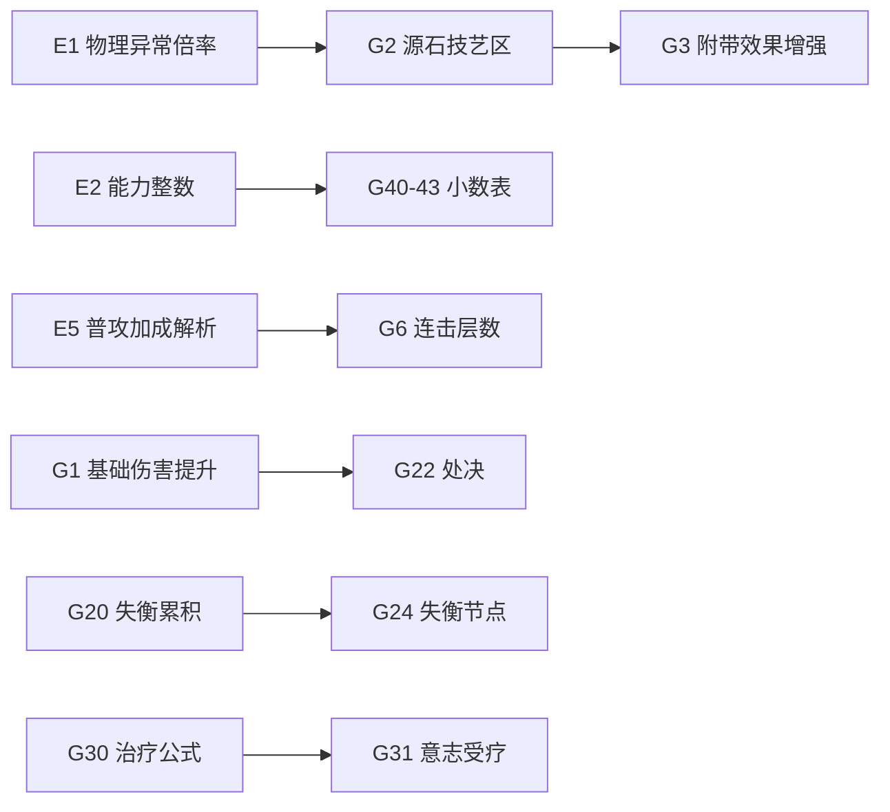

# NGA《终末地数据机制导论》对照与待办

> **来源**：[NGA tid=46094556](https://bbs.nga.cn/read.php?tid=46094556&_ff=510553)（作者 666bj，2026-01-29 首发，文内更新至 2026-02-28）  
> **用途**：与当前仓库 `games/endfield/` 计算器实现对照；后续按优先级逐项实现。  
> **对照日期**：2026-06-01（代码基线：15 乘区 DAG + 物理/法术异常手动矩阵 + 全量搜索）

---

## 1. 原文结构速览

| 章节 | 主题 |
|------|------|
| PART 01 | 常规伤害 15 乘区 + 攻击力/暴击/加成/减免/增减益/防抗/失衡/非主控/连击/特殊 |
| PART 02 | 异常伤害（物/法异常、法爆发）+ **等级系数区** + **源石技艺强度区** |
| PART 03 | 失衡累积/持续时间/处决/失衡节点/快速打进失衡后的减累积 |
| PART 04 | 治疗、四维衍生、武器/敌人成长、技力与终结技能量 |
| PART 05 | 附表（装备小数、源石技艺显示值、消耗品等） |

文内强调：**面板大量向下取整**，固定攻击/防御/源石技艺/部分 % 词条带隐藏小数；**技能面板倍率有时与实战参数不一致**。

---

## 2. 已与实现对齐（可视为基线）

| 机制 | 实现位置 | 备注 |
|------|----------|------|
| 常规 15 乘区顺序与公式形态 | `games/endfield/calc/damage/engine/calculate.py`、`endfield_full.dag.json` | 与文 1.1–1.15 一致 |
| 最终攻击力链 | `multiplicative_zones/final_attack_zone.py` | `(基础+武器)×(1+%)+平值` 再 × 能力值加成 |
| 能力值加成系数 | `ability_bonus_calc.py` | 主×0.005 + 副×0.002 |
| 暴击期望/必暴/非暴 | `engine/helpers.py` | 基础暴率 5%、暴伤 50% 由上下文传入 |
| 伤害减免连乘 | `calculate.py` | Π(1−减免) |
| 增幅加算、虚弱连乘、庇护取 max、脆弱/易伤加算 | 同上 + `equipment/system.py` 词条归类 |
| 防御区 `100/(DEF+100)`、默认敌防 100 | `DamageContext` + 敌方面板 | |
| 失衡易伤系数（默认 1.3） | `enemy_params.py`、`DamageContext` | 仅开关「是否失衡」，无累积条 |
| 抗性区 `1−抗/100+无视/100` | `calculate.py` | 敌抗由面板/插件传入 |
| 法术异常/爆发倍率表 | `manual_buff/spell_params.py` | 交叉 80%、燃烧 DoT、爆发 160%、碎冰 120% 等 |
| 法术异常等级系数 `/196` | `manual_buff/spell.py` | 公测口径 |
| 物理异常等级系数 `/392` | `manual_buff/physical.py` | 公测新增 |
| 物理异常四类手动次数 | `manual_buff/physical.py` + GUI 矩阵 | 倒地/击飞/碎甲/猛击 |
| 超域/复合元素伤害类型 | `calc/damage/types.py`、装备 affix | |
| 战技/连携/终结 技能类型加成 | `equipment/affix.py` | 见 §3「未做」普通攻击 |

---

## 3. 错误或与原文不一致

| ID | 状态 | 说明 |
|----|------|------|
| **E1** | ✅ 2026-06-01 | `manual_buff/abnormal_common.py`：`碎甲/猛击` 使用 `0.5/1.5 × (1+异常等级)` |
| **E2** | ✅ 2026-06-01 | `ability_bonus_calc.py` / `ability_bonus_details.py`：主副能力取整后乘系数 |
| **E3** | ✅ 2026-06-01 | `incoming.py`：敏捷/智识承伤抗性乘数（§1.12） |
| **E4** | ✅ 2026-06-01 | `calculate_single_hit_damage(..., damage_pipeline="abnormal")` 跳过连击/非主控 |
| **E5** | ✅ 2026-06-01 | `affix.py`：普通攻击、全技能(战/连/终)、源石技艺强度平铺 |

---

## 4. 未做 / 仅部分支持

### 4.1 伤害与乘区（P0–P1）

| ID | 机制 | 原文要点 | 现状 | 优先级 |
|----|------|----------|------|--------|
| **G1** | ✅ 2026-06-01 | `DamageContext.base_damage_bonus`，基础区 = 攻击×倍率 + 提升值 |
| **G2** | ✅ 2026-06-01 | `originium_arts.py` + 异常结算后乘区；搜索快照带 `originium_arts_strength` |
| **G3** | ✅ 2026-06-01 | `abnormal_attached.py`：导电易伤/碎甲物易伤/腐蚀初减抗 + 源石增强 |
| **G4** | ✅ 2026-06-01 | 敌方面板「附带效果倍率」→ `attached_effect_multiplier` |
| **G5** | ✅ 2026-06-01 | `corrosion.py` + 腐蚀计时秒数；自然异常结算接入 |
| **G6** | ✅ 2026-06-01 | `DamageContext.combo_stacks` + `combo_bonus.py` 层数表 |
| **G7** | ✅ 2026-06-01 | 手动 buff 选项增加虚弱/庇护（14 项） |
| **G8** | 部分 ✅ | `special_damage.py` + 敌方面板「真实伤害」；生命汲取辅助 |
| **G9** | 道具临时加成 | 雅各布遗产、铁瓶 24% 等 | 无道具层；可用手动 buff 近似 | P3 |

### 4.2 异常与状态（P1）

| ID | 机制 | 现状 |
|----|------|------|
| **G10** | 部分 ✅ | `break_defense.py` 破防层数→易伤 API；完整状态机待做 |
| **G11** | 部分 ✅ | 法术异常键前缀 ``强制:`` → 无初始伤 |
| **G12** | ✅ 2026-06-01 | `incoming.py`：`enemy_burn_tick_damage`（承伤估算） |
| **G13** | ✅ 2026-06-01 | 异常矩阵改为 倒地/猛击等 + L0–L4 列；`abnormal_matrix.py` |

### 4.3 失衡系统（P1–P2）

| ID | 机制 | 现状 |
|----|------|------|
| **G20** | ✅ 2026-06-01 | `imbalance.py`：累积缩放、等阶上限/时长、节点阈值 |
| **G21** | 部分 ✅ | 敌方面板等阶 + 处决/治疗对话框 + 失衡上限/节点参考 |
| **G22** | ✅ 2026-06-01 | `damage/execute.py`：`calculate_execute_damage` |
| **G23** | ✅ 2026-06-01 | `execute_sp_restore()` 同文件 |
| **G24** | ✅ 2026-06-01 | `imbalance_nodes_crossed` + 节点阈值 API |
| **G25** | ✅ 2026-06-01 | `accumulation_multiplier_after_fast_break` |

### 4.4 治疗与生存（P2）

| ID | 机制 | 公式摘要 | 现状 |
|----|------|----------|------|
| **G30** | ✅ 2026-06-01 | `damage/healing.py`：`calculate_healing` |
| **G31** | ✅ 2026-06-01 | `received_heal_efficiency_from_will` |
| **G32** | ✅ 2026-06-01 | `character_stats.py`：`total_max_hp` |

### 4.5 数值精度与数据（P1）

| ID | 机制 | 现状 |
|----|------|------|
| **G40** | 部分 ✅ | `display_corrections.py` 附表扩展（攻/防/源石） |
| **G41–G43** | 部分 ✅ | 防御 21/28/36、源石 70/24/29/41、%12.3 校正 |
| **G44** | 部分 ✅ | `segments.py` 可选 `*实战倍率` 字段；计算用实战、标签双显 |

### 4.6 战斗循环（P3，偏模拟器）

| ID | 机制 | 说明 |
|----|------|------|
| **G50** | 技力 8/s、重击回能、闪避 ~7.5、返还技力不计终结充能 | 非当前「单段/配装」核心；可做独立 DPS 模拟 |
| **G51** | 终结技能量 6.5/100 技力、连携 +10 等 | 同上 |
| **G52** | 敌人生命/攻击成长线型 | 文建议勿硬算；插件敌人仅防/抗 |

### 4.7 产品与文档

| ID | 项 | 现状 |
|----|-----|------|
| **G60** | Web 终末地页 | P4 进行中，能力落后于桌面 GUI |
| **G61** | 部分 ✅ | F1 说明书「NGA 机制对照」节 + 链至仓库文档 |
| **G62** | 会话手册 §3 | 完成大块后由维护者更新 |

---

## 5. 建议实现顺序（供排期）

**第一批（验算对齐）**：E1、E2、G2、E5、E4（需 1–2 个游戏内对照用例写进 `games/endfield/tests/`）  
**第二批（异常/配装）**：G3、G6、G1、G40–G43（数据表或 `tools/` 校准脚本）  
**第三批（系统向）**：G20–G25、G22–G23、G30–G31  
**第四批（模拟/承伤）**：G12、G50–G52、Web G60  

---

## 6. 测试与验收建议

- 每个 **E*** 修复：增加「NGA 文内数值」回归用例（固定攻击、敌防、层数、等级）。  
- **G2/G3**：用文 2.4 截图例（源石 70.8、导电易伤 20.63%）做断言。  
- **E1**：碎甲 L1 层 → 倍率 100%（非 50%）。  
- 全量搜索评分：G2 落地后需确认是否将源石技艺纳入 `evaluate_task` 的异常分项。  

---

## 7. 相关仓库路径

| 模块 | 路径 |
|------|------|
| 15 乘区引擎 | `games/endfield/calc/damage/engine/` |
| 物理/法术异常 | `games/endfield/calc/manual_buff/` |
| DAG / ComputeSheet | `framework/src/calc_framework/configs/endfield_full.dag.json` |
| 装备词条 | `games/endfield/calc/equipment/affix.py` |
| 敌方参数 | `games/endfield/gui_design/controls/enemy/`、`data_loading/enemy_params.py` |
| 领域术语 | `CONTEXT.md` |

---

## 8. 更新记录

| 日期 | 说明 |
|------|------|
| 2026-06-01 | 初版：通读 NGA 全文并对照当前 `games/endfield` 实现 |
| 2026-06-01 | 实现 E1/E2/E4/E5、G1/G2（见 `test_nga_mechanics.py`） |
| 2026-06-01 | 第六批 G8/G11/G61 + 真实伤害 GUI |
| 2026-06-01 | 第七批 G44/G40–43 扩展、搜索 `is_true_damage`、`break_defense.py`、失衡参考 GUI |
