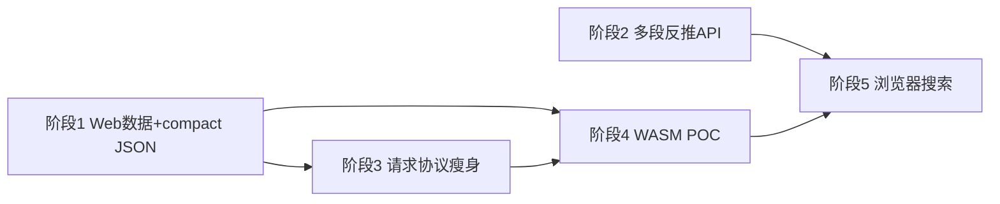

# Web 简化数据 + 浏览器计算（WASM）+ 多段反推 — 实施计划

**状态**：阶段 1–2 代码已完成（2026-06-15）；磁盘 `compact --apply` 仍由人类本地执行  
**关联**：[`search-perf-and-json-compaction-plan.md`](search-perf-and-json-compaction-plan.md)（磁盘 compact）、[`adr/0026-multi-segment-curve-blueprint.md`](../adr/0026-multi-segment-curve-blueprint.md)（N 段反推）、[`PythonAnywhere-部署指南.md`](../PythonAnywhere-部署指南.md)

---

## 1. 目标（用户愿景）

| # | 目标 | 成功标准 |
|---|------|----------|
| G1 | **网站用简化数据** | 下发/缓存以 `成长参数`（及 AK `segments[]`）为主，不传 90 档完整数组 |
| G2 | **网站计算与桌面一致** | 浏览器内完成配装快照 DAG 求值（WASM 或等价客户端引擎），减少「必须下载 exe」 |
| G3 | **框架 N 段 × N 级反推在 Web 可用** | Web API / Designer 可调用 `SegmentCurveEngine`，不限于 90/9/12 单段 |

---

## 2. 现状差距（2026-06-15）

| 能力 | 桌面 / Python 框架 | Web 现状 | 严重度 |
|------|-------------------|----------|--------|
| `成长参数` 双读 | `data_loading/curve_materialize.py` ✅ | `web/backend/api/data.py` 直接 `load_json` ❌ | MED |
| 磁盘 compact JSON | 工具已有；`--apply` 未执行 | 同上 | MED |
| 计算引擎 | Python DAG ✅ | FastAPI `/api/compute/*`；**无 WASM** ❌ | HIGH |
| 全量搜索 | 本地多进程 ✅ | PA 受限 + 下载 `local-backend.zip` ❌ | HIGH |
| N 段反推 | `CurveBlueprint` + AK/终末地 adapter ✅ | `/inverse/segment` + `/inverse/milestones` ✅；legacy `/inverse` 兼容 ✅ | OK |
| 前端曲线烘焙 | N/A | 无 TS 版 `floor_linear` ❌ | MED |
| PWA 离线 | N/A | 仅缓存静态 + API，不含计算 ❌ | LOW |

---

## 3. 优先级与阶段（推荐执行顺序）

> **原则**：先「数据变轻 + Web 接缝对齐桌面」（低风险、立刻减体积），再「API 反推升级」，最后「WASM 大项 POC → 全量」。

### 阶段 1 — P0：Web 数据接缝 + compact 数据上线（1–2 周）

**Why first**：不依赖 WASM；与已完成的 `curve_materialize` / `compact_game_json` 直接复用；PA 带宽与内存立刻改善。

| ID | 任务 | 产出 | 依赖 |
|----|------|------|------|
| 1.1 | Web 数据 API 接入 `materialize_character_entity` / `materialize_weapon_entity`（或加载层 wrapper） | 运行时数组一致；可选 query `?format=compact` 只返回 `成长参数` | ✅ `web/backend/data_materialize.py` |
| 1.2 | 新增 **compact 详情端点**（或默认详情不含可再生的数组字段） | `GET /characters/{name}` 体积显著下降 | ✅ `?format=compact\|runtime\|raw` |
| 1.3 | 计算/搜索请求体瘦身：`char_data`/`weapon_data` 允许仅含 `成长参数` + `level` 字段 | `web_loadout_bridge` 在服务端按 level 烘焙 | ✅ `WebLoadoutBody` 物化 + 前端 `compactEntityForTransport` |
| 1.4 | 人类/CI：对 `games/endfield/data/*.json` 执行 `compact_game_json --apply`（git 备份后） | 磁盘与部署包变小 | 工具已有 |
| 1.5 | AK：`sync_operators` → `compact_arknights_operators --apply`（本地数据） | parsed 含 `成长参数` | 工具已有 |
| 1.6 | 验收：`test_game_data_contract` + Web 集成测试；随机 3 角色迁移前后 diff ≤ 0.1 | 文档 §验收 | 1.4 |

**勿做**：阶段 1 不要求 WASM；不要求 Designer 多段 UI。

---

### 阶段 2 — P1：Web 多段反推 API（1 周）

**Why second**：框架已就绪；改 API 即可服务 AK / 未来游戏；与 compact 数据形态一致。

| ID | 任务 | 产出 | 依赖 |
|----|------|------|------|
| 2.1 | 新端点 `POST /api/data/inverse/segment`：`blueprint_key` + `segment_key` + `values[]` | 调用 `SegmentCurveEngine.fit_by_key` | ✅ |
| 2.2 | 新端点 `POST /api/data/inverse/milestones`（AK）：干员里程碑 → `fit_operator_growth_params` | 与 `compact_arknights_operators` 同逻辑 | ✅ |
| 2.3 | 旧 `/api/data/inverse` 保留为兼容层（内部转调 `EndfieldInverseAdapter`） | 现有 Designer 不 break | ✅ |
| 2.4 | 测试：`framework/tests/inverse/*` + `web/backend/tests` 覆盖新端点 | CI 绿 | ✅ `test_inverse_api.py` |
| 2.5 | Designer **可选**：反推页增加「段 key / 段长」高级模式（ADR-0026 非目标，可后置） | UI | 2.1 |

---

### 阶段 3 — P1：计算请求协议统一（与阶段 2 可并行）

| ID | 任务 | 产出 | 依赖 |
|----|------|------|------|
| 3.1 | 定义 `WebEntityRef`：`{ name, 成长参数?, level, trust_level? }` 替代整包 JSON | OpenAPI / TS 类型 | 阶段 1 |
| 3.2 | 搜索 `SearchRequest` 改为传武器 **name 列表** + 服务端 catalog，而非 `all_weapons` 全量 | POST 体积下降 | 1.1 |
| 3.3 | 前端 `ComputePage` / `loadout.ts` 适配新协议 | 前端 | 3.1–3.2 |

---

### 阶段 4 — P2：WASM 计算 POC（2–4 周，需技术选型）

**Why later**：工作量大；必须先有阶段 1 的「参数契约 + golden 测试」，否则 WASM 与 Python 易分叉。

| ID | 任务 | 选项 | 产出 |
|----|------|------|------|
| 4.0 | **选型 ADR** | A) Pyodide 打包 Python 计算栈；B) Rust/TS 重写 DAG+公式；C) 混合（TS 烘焙 + WASM 轻量 DAG） | `docs/adr/00xx-web-wasm-calc.md` |
| 4.1 | POC：单快照 `evaluate-loadout` 与 Python 同输入 golden ≤ 1e-6 | 依 4.0 | `web/wasm/` 或 `web/frontend/src/calc/` |
| 4.2 | 前端开关：`calc_backend=wasm|api`（默认 api，POC 通过后 wasm） | 特性开关 | 4.1 |
| 4.3 | 体积与冷启动预算：首包 ≤ ? MB，FCP 可接受 | 文档 | 4.1 |

**非目标（阶段 4）**：全量搜索 WASM、SQLite 续跑进浏览器。

---

### 阶段 5 — P3：浏览器侧搜索 / 离线（远期）

| ID | 任务 | 说明 |
|----|------|------|
| 5.1 | Web Worker + WASM 枚举 TopN（小 catalog） | 替代 PA 上「只能估算 + 下载 exe」 |
| 5.2 | PWA 预缓存 compact JSON + WASM 引擎 | 弱网可用 |
| 5.3 | 可选：与本地 exe 搜索共用 `search_output` 格式 | 生态 |

---

## 4. 依赖关系图

---

## 5. 验收清单（分阶段）

### 阶段 1

- [ ] `GET /api/data/characters/{name}?format=compact` 无 `力量` 等 90 档数组（有 `成长参数` 时）
- [ ] Web 选角后单次 `evaluate-loadout` POST body 体积较现状下降 ≥50%（抽样 3 角色）
- [ ] `pytest web/backend/tests` + `games/endfield/tests/data/test_curve_materialize*.py` 通过
- [ ] PA 部署文档补充 compact JSON 与 API 说明

### 阶段 2

- [ ] AK 6★ 单段 `e0.hp` 反推经 Web API 与 `test_inverse.py` 一致
- [ ] 旧 Designer 反推页仍可用（回归）

### 阶段 4

- [ ] 同一 loadout：WASM vs Python `outputs` 全键一致（golden 文件）
- [ ] `npx tsc --noEmit` 0 error

---

## 6. 风险与决策记录

| 决策 | 推荐 | 理由 |
|------|------|------|
| 先 WASM 还是先 compact API | **先 compact API** | 复用现有 Python；WASM 无代码基础 |
| Web 详情默认 compact 还是 opt-in | **默认 compact + `?full=1` 调试** | 符合 G1；设计器编辑仍需 full |
| WASM 技术栈 | **阶段 4 写 ADR 再定** | Pyodide 快但重；TS 重写维护成本高 |
| 搜索是否必须 WASM | **否；阶段 5** | 可先保留下载 exe + 改进 PA 估算 |

---

## 7. 文档同步（每阶段完成时）

- `docs/会话接续手册.md` §4 追加条目
- `docs/操作指令集.md` — Web API / compact / WASM 开关
- `docs/README.md` — 本计划索引
- `CONTEXT.md` — 若新增术语（如 `WebEntityRef`）

---

## 8. 当前建议的「下一步编码」（阶段 1.1 起）

1. 在 `web/backend/api/_json_utils.py` 或新模块 `web/backend/data_materialize.py` 封装 `load_characters_materialized()`
2. `get_character` / `list_characters_full` 支持 `format=compact|runtime|raw`
3. 单测：`web/backend/tests/test_data_compact_api.py`
4. **不**在本阶段引入 WASM
